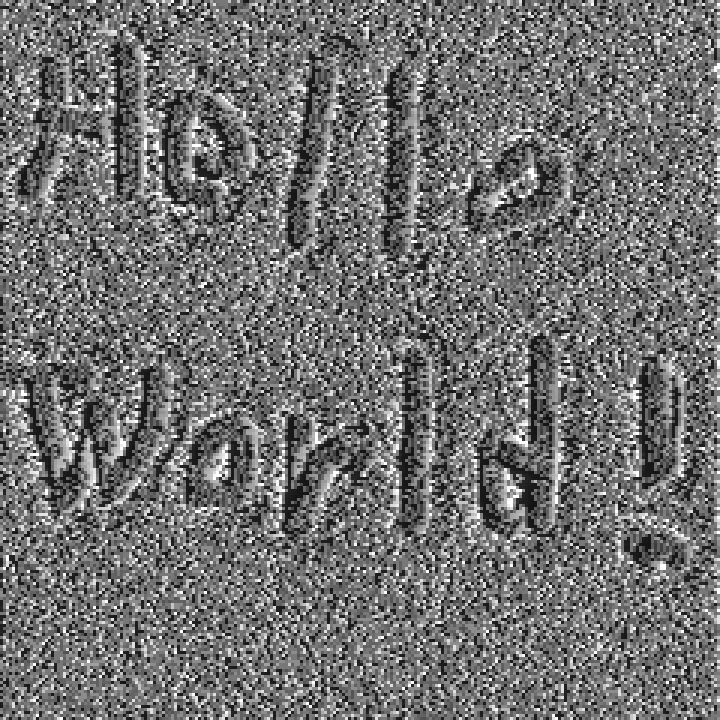
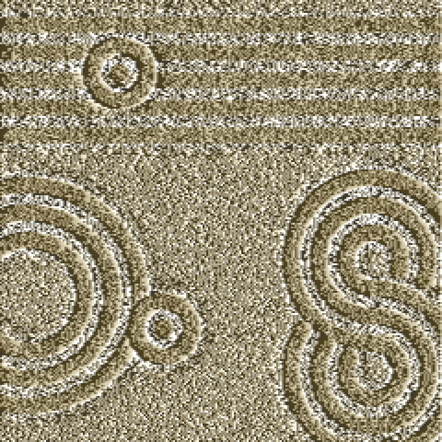
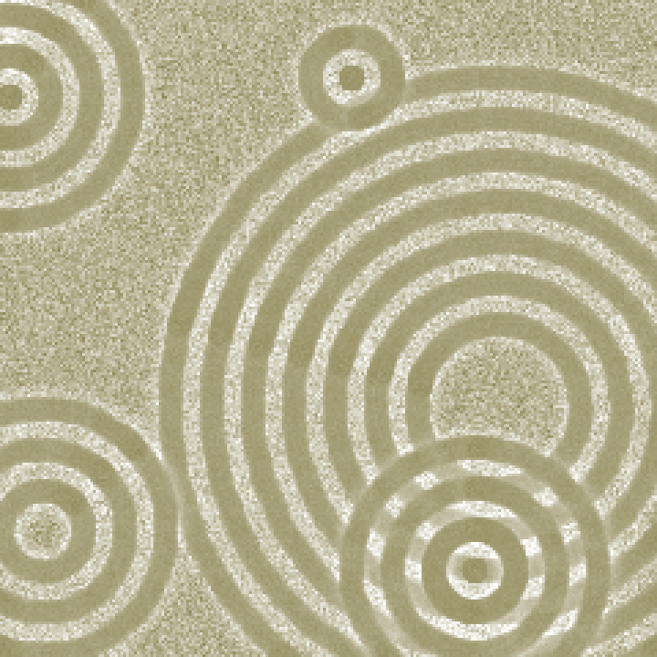

# Sand Canvas with Rake

## Demo
You can try this tool on the page below.

https://black-sesame-ice-cream.github.io/Sand-Canvas-with-Rake/

## デモ
以下のページでこのツールを試すことができます。

https://black-sesame-ice-cream.github.io/Sand-Canvas-with-Rake/

## Overview
This is a web tool that allows you to draw patterns on a sand canvas. By using the mouse as a brush or a rake, you can dig into the sand or smooth it out to design your own unique karesansui.

## 概要
これは、砂のキャンバスに模様を描くことができるwebツールです。マウスをブラシや熊手として使い、砂を掘ったり平らにならしたりすることで、枯山水をデザインできます。

## Recommended Environment
This tool is designed for use on a PC with the Google Chrome browser. Operation on other devices or browsers is not guaranteed.

## 推奨環境
このツールは、PC上のGoogle Chromeブラウザでの使用を想定しています。他のデバイスやブラウザでの動作は保証されていません。

## Controls
### Mouse Controls
- Left Click + Drag: Digs into the sand to create grooves.

- Right Click + Drag: Resets the sand to its original state, smoothing it out.

### Rake Mode
Press the K key to toggle Rake Mode. A rake will appear, allowing for more complex patterns.

- Toggle Rake Mode: Press the K key. The rake will appear at your cursor's location.

- Move Rake: Left-click and drag the center tine (red) to move the entire rake.

- Pivot Rake: Left-click and drag any of the outer tines (black) to pivot the rake around the opposite end. The green tines are pivot points.

- Auto-Rotate: Right-click the center tine (red) to start an automatic rotation for creating circular patterns. Release the right mouse button to stop.

### Keyboard Shortcuts
- K: Toggle Rake Mode on/off.

- H: Instantly set the rake to a horizontal position.

- V: Instantly set the rake to a vertical position.

- S: Save your current creation as a PNG file.

- R: Reset the entire canvas to its initial state.

### GUI Panel
- Brush Settings: Adjust the depth and radius of the digging and resetting brushes.

- Appearance: Change the colors of the sand, shadow intensity, and light direction.

- Rake Settings: Customize the number of pivot tines on the rake.

- Actions: Buttons for common operations like changing rake orientation, saving, and resetting.

## 操作
### マウス操作
- 左クリック + ドラッグ: 砂を掘り、溝を作成します。

- 右クリック + ドラッグ: 砂を初期状態に戻し、平らにならします。

### 熊手モード
Kキーを押すと熊手モードに切り替わります。熊手が表示され、より複雑な模様を描くことができます。

- モード切替: Kキーを押します。カーソル位置に熊手が表示されます。

- 熊手の移動: 中央の歯（赤色）を左クリックしてドラッグすると、熊手全体が移動します。

- 熊手の回転: 外側の歯（黒色）を左クリックしてドラッグすると、反対側の端を軸にして熊手が回転します。緑色の歯が回転の軸となります。

- 自動回転: 中央の歯（赤色）を右クリックすると、円形の模様を描くための自動回転が始まります。右クリックを離すと停止します。

### キーボードショートカット
- K: 熊手モードのON/OFFを切り替えます。

- H: 熊手を瞬時に水平にします。

- V: 熊手を瞬時に垂直にします。

- S: 現在の作品をPNGファイルとして保存します。

- R: キャンバス全体を初期状態にリセットします。

### GUIパネル
- Brush Settings: 掘るブラシとリセットするブラシの深さや半径を調整します。

- Appearance: 砂の色、影の強さ、光源の方向などを変更します。

- Rake Settings: 熊手の回転軸となる歯の数を調整します。

- Actions: 熊手の向きの変更、保存、リセットなど、主要な操作を行うためのボタンです。

## Tech Stack
HTML5 Canvas: For rendering the sand and patterns.

Vanilla JavaScript (ES Modules): For all the logic and interactivity.

lil-gui: For the user-friendly control panel.

CSS3: For styling the layout.